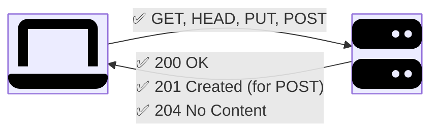
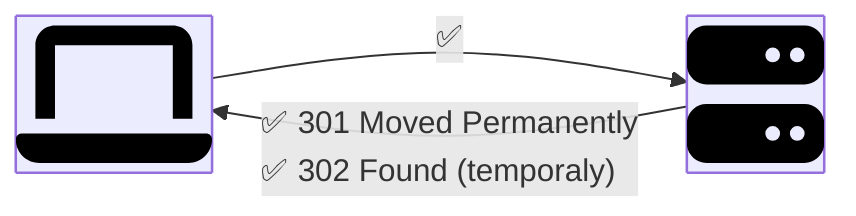
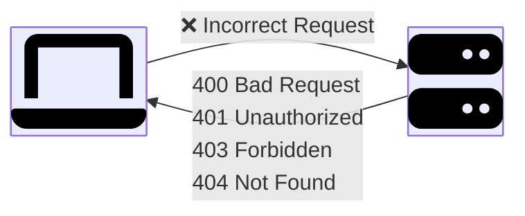
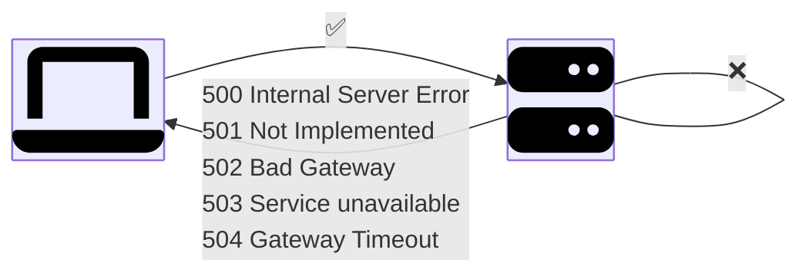

# HTTP Basic

This document provides an overview of the basic concepts of HTTP, including request methods and status codes.

<!-- toc -->

- [Request Methods](#request-methods)
  - [GET](#get)
  - [PUT](#put)
  - [POST](#post)
  - [DELETE](#delete)
  - [PATCH](#patch)
  - [HEAD](#head)
  - [CONNECT](#connect)
  - [OPTIONS](#options)
  - [TRACE](#trace)
- [Status Code](#status-code)
  - [Successful](#successful)
  - [Redirection](#redirection)
  - [Cient Error](#cient-error)
  - [Server Error](#server-error)

<!-- /toc -->

## Request Methods

| Method  | Purpose (summary)                                                       | Safe | Idempotent | Typical Success Codes |
| ------- | ----------------------------------------------------------------------- | ---- | ---------- | --------------------- |
| GET     | Retrieve a representation of a resource (no state change).              | Yes  | Yes        | 200 (OK), 304 (cache) |
| PUT     | Create/replace entire resource at the target URI.                       | No   | Yes        | 200, 201 (create),204 |
| POST    | Create subordinate resource / process subordinate action.               | No   | No         | 201, 202, 200         |
| DELETE  | Remove the resource.                                                    | No   | Yes        | 204, 200, 202         |
| PATCH   | Apply a partial modification to a resource.                             | No   | Not always | 200, 204              |
| HEAD    | Same as GET but return only headers (metadata / caching).               | Yes  | Yes        | 200, 304              |
| CONNECT | Establish a tunnel (usually for TLS via HTTP proxy).                    | No   | No         | 200                   |
| OPTIONS | Describe communication options / allowed methods for a resource/server. | Yes  | Yes        | 200                   |
| TRACE   | Echo received request (diagnostics; usually disabled).                  | Yes  | Yes        | 200                   |

> [!NOTE]
>
> - Safe: does not modify server state.
> - Idempotent: multiple identical requests have same effect.
> - Caching: GET/HEAD cacheable by default (if headers allow); others conditional (e.g., POST if explicitly marked).

### GET

Retireve a single iterm or a list of items.

**URI**:

`/v1/products/iphone`

**Response**:

```html
<html>
  <head>
    iphone
  </head>
  <body>
    <h1>iPhone</h1>
    <p>This is an iPhone</p>
  </body>
</html>
```

### PUT

Update an item.

**URI**:

`/v1/users/123`

**Request Body**:

```json
{
  "name": "foo",
  "email": "bar@baz.com"
}
```

**Response**:

```http
HTTP/1.1 200 OK
```

### POST

Create an item.

**URI**:

`/v1/users`

**Request Body**:

```json
{
  "firstname": "foo",
  "lastname": "bar",
  "email": "bar@baz.com"
}
```

**Response**:

```http
HTTP/1.1 201 Created
```

### DELETE

DELETE an item.

**URI**:

`/v1/users/123`

**Response**:

```http
HTTP/1.1 200 OK
HTTP/1.1 204 NO CONTENT
```

### PATCH

**Partially** modify an item.

**URI**:

`/v1/users/123`

**Request Body**:

```json
{
  "email": "qux@baz.com"
}
```

**Response**:

```http
HTTP/1.1 200 OK
```

### HEAD

Same semantics as GET but body omitted (used for cache validation, size checks).

**URI**:

`/v1/products/iphone`

**Response**:

```http
HTTP/1.1 200 OK
```

### CONNECT

Tunnel through an HTTP proxy (e.g., for TLS handshake).

**URI**:

`xxx.com:80`

**Request**:

```http
Host: xxx:80
Proxy-Authorization: basic RXhhbXBzRphaQ==
```

**Response**:

```http
HTTP/1.1 200 OK
```

### OPTIONS

Discover allowed methods.

**URI**:

`/v1/users`

**Response**

```http
HTTP/1.1 200 OK
Allow: GET,POST,DELETE,HEAD,OPTIONS
```

### TRACE

Loop-back test returning the received request (usually disabled for security: XST risk).

**URI**:

`/index.html`

**Response**:

```http
Host: xxxxx
Via: 1.1 xxxx: 3221
X-Forwarded-For: xx.xxx.xxx.x
```

## Status Code

| Category     | Code | Message                | Explain                                                |
| ------------ | ---- | ---------------------- | ------------------------------------------------------ |
| Success      | 200  | OK                     | Request succeeded.                                     |
|              | 201  | Created                | New resource successfully created.                     |
|              | 202  | Accepted               | Request accepted for processing; not yet completed.    |
|              | 204  | No Content             | Successful; no response body returned.                 |
| Redirection  | 301  | Moved Permanently      | Resource permanently moved to a new URI.               |
|              | 302  | Found                  | Temporary redirect to a different URI.                 |
|              | 304  | Not Modified           | Cached version is still valid; no body sent.           |
|              | 307  | Temporary Redirect     | Like 302 but method must not change.                   |
|              | 308  | Permanent Redirect     | Like 301 but method must not change.                   |
| Client Error | 400  | Bad Request            | Malformed request; cannot be processed.                |
|              | 401  | Unauthorized           | Authentication required or failed.                     |
|              | 403  | Forbidden              | Authenticated but not permitted.                       |
|              | 404  | Not Found              | Resource could not be located.                         |
|              | 405  | Method Not Allowed     | Method not supported for this resource.                |
|              | 409  | Conflict               | Request conflicts with current resource state.         |
|              | 410  | Gone                   | Resource intentionally removed; no forwarding address. |
|              | 415  | Unsupported Media Type | Media format not supported.                            |
|              | 418  | I'm a teapot           | Easter egg status (RFC 2324).                          |
|              | 429  | Too Many Requests      | Rate limit exceeded; slow down.                        |
| Server Error | 500  | Internal Server Error  | Generic server-side failure.                           |
|              | 501  | Not Implemented        | Server lacks capability to fulfill the request.        |
|              | 502  | Bad Gateway            | Invalid response from upstream server.                 |
|              | 503  | Service Unavailable    | Server overloaded or down for maintenance.             |
|              | 504  | Gateway Timeout        | Upstream server failed to respond in time.             |

### Successful



### Redirection



### Cient Error



### Server Error



https://chatgpt.com/s/t_68a84cb847c08191920530fa31d2f76f
