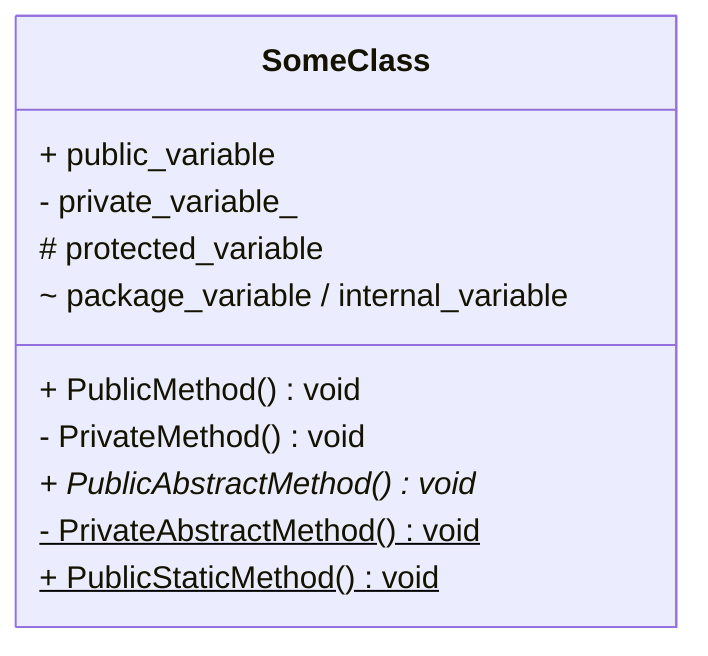
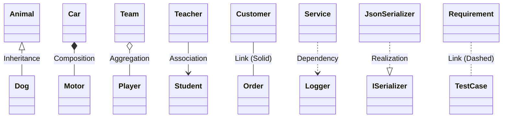
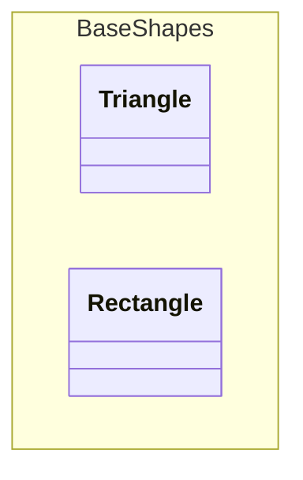
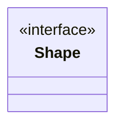

# Class diagram

This page shows the syntax of class diagram for the Marmaid.js.

<!-- toc -->

- [Defining members](#defining-members)
- [Defining Relationship](#defining-relationship)
- [Namespace](#namespace)
- [Annotations on classes](#annotations-on-classes)

<!-- /toc -->

## Defining members



## Defining Relationship



| Type  | Description   | Explain                                                                                               |
| ----- | ------------- | ----------------------------------------------------------------------------------------------------- |
| `<--` | Inheritance   | Generalization (is-a). Arrow points to the base type.                                                 |
| `*--` | Composition   | Strong whole-part. Part's lifetime is bound to the whole.                                             |
| `o--` | Aggregation   | Weak whole-part. Parts can exist independently or be shared.                                          |
| `-->` | Association   | Directed navigable association (structural link) from source to target.                               |
| `--`  | Link (Solid)  | Undirected association. Generic structural relation without ownership or navigability.                |
| `..>` | Dependency    | Client uses a supplier (compile/run-time), no structural link. Changes in supplier may affect client. |
| `..>` | Realization   | Implements a contract/interface or specification.                                                     |
| `..`  | Link (Dashed) | Non-structural dashed link.                                                                           |

> [!NOTE]
> A lollipop interface is defined using the following syntax:
> `foo --()bar` or `bar ()--()`.
> The interface (bar) with the lollipop connects to the class (foo).
>
> ```mermaid
> classDiagram
>   foo --() bar
> ```
>
> ```mermaid
> classDiagram
>   bar ()-- foo
> ```

## Namespace



## Annotations on classes


