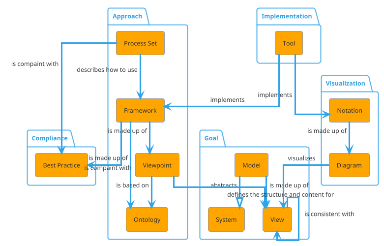

# MBSE

## MBSE in a slide

```plantuml
@startuml
!theme cerulean
skinparam linetype ortho

package Compliance {
  agent "Best Practice" as best_practice
}

package Approach {
  agent "Process Set" as process_set
  agent "Framework" as framework
  agent "Ontology" as ontology
  agent "Viewpoint" as viewpoint
}

package Goal {
  agent "System" as system
  agent "Model" as model
  agent "View" as view
}

package Visualization {
  agent "Notation" as notation
  agent "Diagram" as diagram
}

package Implementation {
  agent "Tool" as tool
}

framework --> ontology: is made up of
framework --> viewpoint: is made up of
viewpoint --> ontology: is based on
process_set --> framework: describes how to use
framework --> best_practice: is compaint with
process_set --> best_practice: is compaint with

model --|> system: abstracts
model --> view: is made up of
view --> view: is consistent with
viewpoint --> view: defines the structure and content for

diagram --> view: visualizes
notation --> diagram: is made up of

tool --> notation: implements
tool --> framework: implements

@enduml
```
