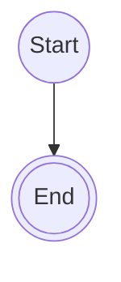

# <iconify-icon icon="logos:slidev" style="vertical-align: middle;"></iconify-icon>Slidev


<!-- toc -->

- [What is Slidev?](#what-is-slidev)
- [📦 Setup](#-setup)
  - [Setup project](#setup-project)
  - [Install code block icons](#install-code-block-icons)
- [🚀 Usage](#-usage)
  - [Start development server](#start-development-server)
  - [Syntax of Slidev](#syntax-of-slidev)
  - [Layout](#layout)

<!-- /toc -->

## What is Slidev?

Slidev is a presentation tool for developers.
It uses Markdown to create slides.
It is built on top of Vue and Vite.
You can use Vue components, code highlighting, and live coding in your slides.

## 📦 Setup

### Setup project

---

#### Option 1: npm

To create a new Slidev project, run the following command:

```sh
npm create slidev@latest
```

The folder structure of the project will look like this:

```diff
+ your-project/
+ ├── components/
+ ├── node_modules/
+ ├── pages/
+ ├── snippets/
+ ├── package-lock.json
+ ├── package.json
+ ├── vercel.json
+ ├── README.md
+ ├── slides.md
+ └── netlify.toml
```

---

#### Option 2: pnpm

```sh
pnpm create slidev@latest
```

---

#### Option 3: vite+

```sh
vp create slidev
```

---

### Install code block icons

#### Option 1: npm

```sh
npm install --save-dev @iconify-json/vscode-icons
```

#### Option 2: pnpm

```sh
pnpm add -D @iconify-json/vscode-icons
```

#### Option 3: vite+

```sh
vp add -D @iconify-json/vscode-icons
```

## 🚀 Usage

### Start development server

#### Option 1: npm

```sh
npm run dev
```

#### Option 2: pnpm

```sh
pnpm run dev
```

#### Option 3: vite+

```sh
vp run dev
```

> [!NOTE]
> After running the command, you can access the presentation at
> `http://localhost:3030` in your web browser.

### Syntax of Slidev

#### Slide deparator

Slides are separated by `---` in the `slides.md` file.

```markdown
---
```

#### Front matter & Head matter

Front matter is used to set the theme and layout of the slide.
The format of the front matter is YAML.

Head matter is used to set the title and description of the presentation.
It is placed at the top of the `slides.md` file.

```markdown
---
theme: default
---

# Slide title

---
# This front matter will only apply to the following slide
layout: center
---

# Slide 2

Slide content with layout center

# Slide 3

Slide with no front matter, so it will use the default theme and layout
```

#### Note

```markdown
<!-- This is a note for the speaker. It will not be visible to the audience. -->
```

#### Code blocks

##### Basic

````markdown
```python
import os

print(f"User is {os.env.environment['USER']}")
```
````

##### Line number

If you want to highlight specific lines in the code block,
you can add `{<line_number>}` after the language name as follows:

````markdown
```python{3,4}
import os

print("Hello world")
print(f"User is {os.env.environment['USER']}")
```
````

And additionally, you can also show line numbers
and set the number of start line as follows:

````markdown
```python{*}{lines:true,startLine:5}
import os

print("Hello world")
print(f"User is {os.env.environment['USER']}")
```
````

##### Height limit

If the code block is too long, you can set a height limit to make it scrollable as follows:

````markdown
```python{*}{maxHight:'50px'}
import os
print("Hello world")
print(f"User is {os.env.environment['USER']}")
print("This is a long code block")
```
````

##### Code block group

You can group multiple code blocks together using `::code-group`
and `::` as follows:

````markdown
::code-group

```sh [npm]
npm install slidev@latest
```

```sh [pnpm]
pnpm install slidev@latest
```

::
````

> [!WARNING]
> If you export slides as PDF, the code block group will not
> be rendered correctly.

#### Latex equation

Slidev supports LateX equations using the `katex` library.

##### Inline equation

To write an inline equation, you can use the `$` symbol as follows:

```markdown
f = ma
```

##### Block equation

To write a block equation, you can use the `$$` symbol as follows:

```markdown
$$
f = ma
$$
```

If you'd like to highlight specific part of the equation,
you add `{}` options as follows:

```markdown
$$ {2|3}
\begin{aligned}
\nabla \cdot \vec{E} &= \frac{\rho}{\varepsilon_0} \\
\nabla \cdot \vec{B} &= 0 \\
\nabla \times \vec{E} &= -\frac{\partial\vec{B}}{\partial t} \\
\nabla \times \vec{B} &= \mu_0\vec{J} + \mu_0\varepsilon_0\frac{\partial\vec{E}}{\partial t}
\end{aligned}
$$
```

#### Mermaid diagrams

##### Mermaid

````markdown

````

##### PlantUML

````markdown
```plantuml
class User {
  +name: string
  +email: string
  +password: string
}

class Post {
  +title: string
  +content: string
```
````

### Layout

#### Default layouts

Slidev provides built-in layouts that you can use by setting the `layout`
property in the front matter of a slide.

| Layout            | Description                                                  |
| ----------------- | ------------------------------------------------------------ |
| `center`          | Positions content in the middle of the screen.               |
| `cover`           | Displays the presentation cover page with title and context. |
| `default`         | Basic layout for any type of content.                        |
| `end`             | Final slide layout for presentations.                        |
| `fact`            | Emphasizes facts or data prominently.                        |
| `full`            | Uses entire screen space for content.                        |
| `image-left`      | Places image on the left, content on the right.              |
| `image-right`     | Places image on the right, content on the left.              |
| `image`           | Features an image as the main page content.                  |
| `iframe-left`     | Embeds a web page on the left, content on the right.         |
| `iframe-right`    | Embeds a web page on the right, content on the left.         |
| `iframe`          | Shows a web page as the primary content.                     |
| `intro`           | Introduces the presentation with title, description, author. |
| `none`            | Unstyled layout template.                                    |
| `quote`           | Displays quotations with visual prominence.                  |
| `section`         | Marks the start of a new presentation section.               |
| `statement`       | Features an affirmation as the main content.                 |
| `two-cols`        | Divides the page into two columns using `::right::`.         |
| `two-cols-header` | Header spanning both columns, then splits left/right below.  |

#### Custom layout

You can add custom layouts by creating a layout files.
To add custom layouts, create a `layouts` folder in the root
directory of your project and add your layout files in it as follows:

```diff
  your-project
+ ├── layouts
+ │   └── your-layout.vue
  ├── slides.md
  └── ...
```

Example of _your-layout.vue_

```html [your-layout.vue]
<template>
  <div class="slidev-layout my-layout">
    <slot />
  </div>
</template>

<style scoped>
.my-layout {
  position: relative;
  padding: 6rem 2rem 2rem; /* top padding ≈ h1 height + offset */
}

.my-layout :deep(h1) {
  font-size: 3rem;
  font-weight: bold;
  color: #2563eb;
  position: absolute;
  top: 2rem;
  left: 3rem;
  margin: 0;
}
</style>
```

You can use your custom layout by setting the `layout` property
in the front matter of a slide as follows:

```markdown
---
layout: your-layout
---

Your slide content here
```

> [!TIP]
>
> - If you create a layout file with the same name as a built-in layout,
>   the built-in layout will be overridden by your custom layout.
> - For example, if you create a `center.vue` file in the `layouts` folder,
>   it will override the built-in `center` layout.
