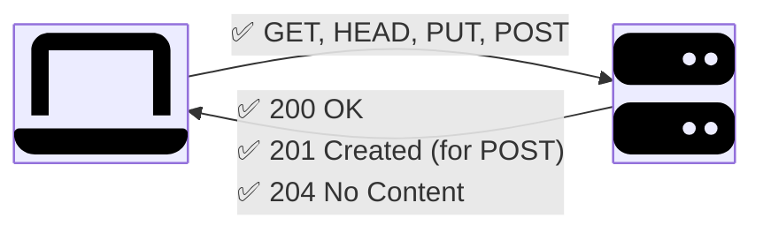
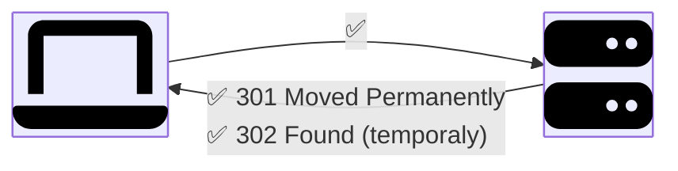
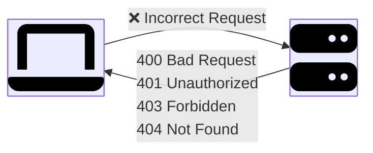
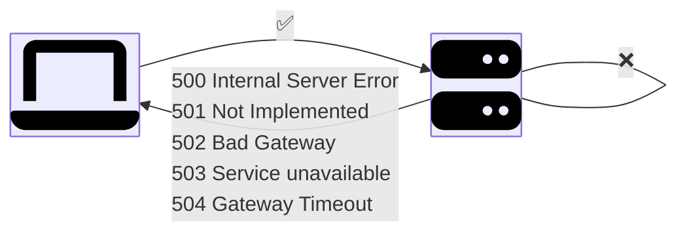

# HTTP Basic

このドキュメントでは、リクエストメソッドやステータスコードを含む HTTP の基本概念について概説します。

<!-- toc -->

- [Request Methods](#request-methods)
  - [GET](#get)
  - [PUT](#put)
  - [POST](#post)
  - [DELETE](#delete)
  - [PATCH](#patch)
  - [HEAD](#head)
  - [CONNECT](#connect)
  - [OPTIONS](#options)
  - [TRACE](#trace)
- [Status Code](#status-code)
  - [Successful](#successful)
  - [Redirection](#redirection)
  - [Cient Error](#cient-error)
  - [Server Error](#server-error)

<!-- /toc -->

## Request Methods

| Method  | 用途 (概要)                                                            | Safe | Idempotent | 一般的な成功コード     |
| ------- | ---------------------------------------------------------------------- | ---- | ---------- | ---------------------- |
| GET     | リソースの表現を取得します (状態変更なし)。                            | Yes  | Yes        | 200 (OK), 304 (cache)  |
| PUT     | 対象 URI のリソース全体を作成または置換します。                        | No   | Yes        | 200, 201 (create), 204 |
| POST    | 従属リソースを作成、または従属アクションを処理します。                 | No   | No         | 201, 202, 200          |
| DELETE  | リソースを削除します。                                                 | No   | Yes        | 204, 200, 202          |
| PATCH   | リソースに部分的な変更を適用します。                                   | No   | Not always | 200, 204               |
| HEAD    | GET と同じですが、ヘッダのみを返します (メタデータ / キャッシング)。   | Yes  | Yes        | 200, 304               |
| CONNECT | トンネルを確立します (通常は HTTP プロキシ経由の TLS 用)。             | No   | No         | 200                    |
| OPTIONS | リソースやサーバで許可されている通信オプションやメソッドを記述します。 | Yes  | Yes        | 200                    |
| TRACE   | 受信したリクエストをエコーします (診断用、通常は無効化されます)。      | Yes  | Yes        | 200                    |

> [!NOTE]
>
> - Safe: サーバの状態を変更しません。
> - Idempotent: 同一のリクエストを複数回実行しても結果は同じです。
> - キャッシング: GET/HEAD はデフォルトでキャッシュ可能です (ヘッダで許可されている場合)。その他は条件付きです (例: POST は明示的に指定されている場合)。

### GET

単一のアイテムまたはアイテムのリストを取得します。

**URI**:

`/v1/products/iphone`

**Response**:

```html
<html>
  <head>
    iphone
  </head>
  <body>
    <h1>iPhone</h1>
    <p>This is an iPhone</p>
  </body>
</html>
```

### PUT

アイテムを更新します。

**URI**:

`/v1/users/123`

**Request Body**:

```json
{
  "name": "foo",
  "email": "bar@baz.com"
}
```

**Response**:

```http
HTTP/1.1 200 OK
```

### POST

アイテムを作成します。

**URI**:

`/v1/users`

**Request Body**:

```json
{
  "firstname": "foo",
  "lastname": "bar",
  "email": "bar@baz.com"
}
```

**Response**:

```http
HTTP/1.1 201 Created
```

### DELETE

アイテムを削除します。

**URI**:

`/v1/users/123`

**Response**:

```http
HTTP/1.1 200 OK
HTTP/1.1 204 NO CONTENT
```

### PATCH

アイテムを **部分的に** 変更します。

**URI**:

`/v1/users/123`

**Request Body**:

```json
{
  "email": "qux@baz.com"
}
```

**Response**:

```http
HTTP/1.1 200 OK
```

### HEAD

GET と同じセマンティクスですが、ボディは省略されます (キャッシュ検証やサイズチェックに使用)。

**URI**:

`/v1/products/iphone`

**Response**:

```http
HTTP/1.1 200 OK
```

### CONNECT

HTTP プロキシ経由でトンネルを確立します (例: TLS ハンドシェイク用)。

**URI**:

`xxx.com:80`

**Request**:

```http
Host: xxx:80
Proxy-Authorization: basic RXhhbXBzRphaQ==
```

**Response**:

```http
HTTP/1.1 200 OK
```

### OPTIONS

許可されているメソッドを確認します。

**URI**:

`/v1/users`

**Response**

```http
HTTP/1.1 200 OK
Allow: GET,POST,DELETE,HEAD,OPTIONS
```

### TRACE

受信したリクエストを返すループバックテストです (XST のリスクがあるため、セキュリティ上、通常は無効化されています)。

**URI**:

`/index.html`

**Response**:

```http
Host: xxxxx
Via: 1.1 xxxx: 3221
X-Forwarded-For: xx.xxx.xxx.x
```

## Status Code

| カテゴリ     | コード | メッセージ             | 説明                                                       |
| ------------ | ------ | ---------------------- | ---------------------------------------------------------- |
| Success      | 200    | OK                     | リクエストが成功しました。                                 |
|              | 201    | Created                | 新しいリソースが正常に作成されました。                     |
|              | 202    | Accepted               | リクエストは受理されましたが、まだ完了していません。       |
|              | 204    | No Content             | 成功しましたが、レスポンスボディはありません。             |
| Redirection  | 301    | Moved Permanently      | リソースが新しい URI に恒久的に移動されました。            |
|              | 302    | Found                  | 別の URI への一時的なリダイレクトです。                    |
|              | 304    | Not Modified           | キャッシュ済みのバージョンが有効で、ボディは送信されません。 |
|              | 307    | Temporary Redirect     | 302 と同様ですが、メソッドを変更してはいけません。         |
|              | 308    | Permanent Redirect     | 301 と同様ですが、メソッドを変更してはいけません。         |
| Client Error | 400    | Bad Request            | 不正なリクエストのため、処理できません。                   |
|              | 401    | Unauthorized           | 認証が必要、または認証に失敗しました。                     |
|              | 403    | Forbidden              | 認証済みですが、許可されていません。                       |
|              | 404    | Not Found              | リソースが見つかりません。                                 |
|              | 405    | Method Not Allowed     | このリソースでは、このメソッドはサポートされていません。   |
|              | 409    | Conflict               | リクエストが現在のリソース状態と競合しています。           |
|              | 410    | Gone                   | リソースが意図的に削除されており、転送先はありません。     |
|              | 415    | Unsupported Media Type | メディア形式がサポートされていません。                     |
|              | 418    | I'm a teapot           | イースターエッグのステータスです (RFC 2324)。              |
|              | 429    | Too Many Requests      | レートリミットを超過しました。リクエストを減らしてください。 |
| Server Error | 500    | Internal Server Error  | サーバ側の一般的な失敗です。                               |
|              | 501    | Not Implemented        | サーバにリクエストを処理する機能がありません。             |
|              | 502    | Bad Gateway            | 上流サーバからの応答が無効です。                           |
|              | 503    | Service Unavailable    | サーバが過負荷、またはメンテナンスのため停止中です。       |
|              | 504    | Gateway Timeout        | 上流サーバが時間内に応答しませんでした。                   |

### Successful



### Redirection



### Cient Error



### Server Error



https://chatgpt.com/s/t_68a84cb847c08191920530fa31d2f76f
