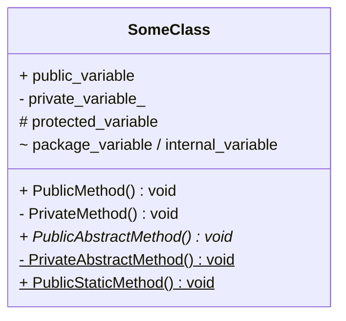
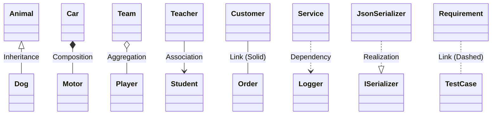
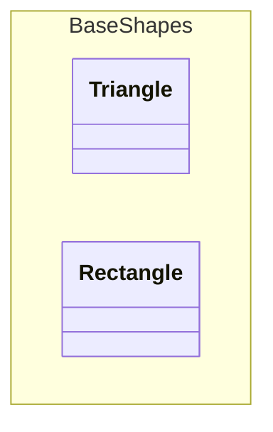
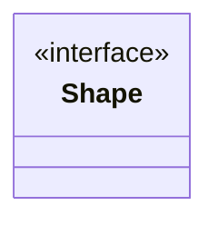

# Class diagram

このページでは、Mermaid.js のクラス図の構文を示します。

<!-- toc -->

- [Defining members](#defining-members)
- [Defining Relationship](#defining-relationship)
- [Namespace](#namespace)
- [Annotations on classes](#annotations-on-classes)

<!-- /toc -->

## Defining members



## Defining Relationship



| 種類  | 名称          | 説明                                                                                                       |
| ----- | ------------- | ---------------------------------------------------------------------------------------------------------- |
| `<--` | Inheritance   | 汎化 (is-a 関係)。矢印は基底型を指します。                                                                 |
| `*--` | Composition   | 強い全体と部分の関係。部分のライフタイムは全体に束縛されます。                                             |
| `o--` | Aggregation   | 弱い全体と部分の関係。部分は独立して存在したり共有されたりできます。                                       |
| `-->` | Association   | ソースからターゲットへ向かう、ナビゲーション可能な有向関連 (構造的なリンク) です。                         |
| `--`  | Link (Solid)  | 無向の関連。所有関係やナビゲーション性を持たない、汎用的な構造的関係です。                                 |
| `..>` | Dependency    | クライアントがサプライヤを利用します (コンパイル時 / 実行時)。構造的なリンクはなく、サプライヤの変更がクライアントに影響する可能性があります。 |
| `..>` | Realization   | コントラクト / インタフェースまたは仕様を実装します。                                                      |
| `..`  | Link (Dashed) | 構造的でない破線のリンクです。                                                                             |

> [!NOTE]
> ロリポップインタフェースは次の構文で定義します。
> `foo --()bar` または `bar ()--()`。
> ロリポップを持つインタフェース (bar) がクラス (foo) に接続されます。
>
> ```mermaid
> classDiagram
>   foo --() bar
> ```
>
> ```mermaid
> classDiagram
>   bar ()-- foo
> ```

## Namespace



## Annotations on classes


