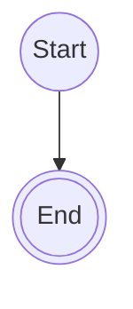

# <iconify-icon icon="logos:slidev" style="vertical-align: middle;"></iconify-icon>Slidev

この記事では、開発者向けのプレゼンテーションツールであるSlidevについて学びます。


<!-- toc -->

- [📝 What is Slidev?](#-what-is-slidev)
- [📦 Setup](#-setup)
  - [Setup project](#setup-project)
  - [Install code block icons](#install-code-block-icons)
- [🚀 Usage](#-usage)
  - [Start development server](#start-development-server)
  - [Syntax of Slidev](#syntax-of-slidev)
  - [Layout](#layout)

<!-- /toc -->

## 📝 What is Slidev?

Slidevは、開発者向けのプレゼンテーションツールです。
Markdownを使用してスライドを作成します。
VueとViteの上に構築されています。
スライド内でVueコンポーネント、コードハイライト、ライブコーディングを使用することができます。

## 📦 Setup

### Setup project

---

#### Option 1: npm

新しいSlidevプロジェクトを作成するには、次のコマンドを実行します。

```sh
npm create slidev@latest
```

プロジェクトのフォルダ構成は次のようになります。

```diff
+ your-project/
+ ├── components/
+ ├── node_modules/
+ ├── pages/
+ ├── snippets/
+ ├── package-lock.json
+ ├── package.json
+ ├── vercel.json
+ ├── README.md
+ ├── slides.md
+ └── netlify.toml
```

---

#### Option 2: pnpm

```sh
pnpm create slidev@latest
```

---

#### Option 3: vite+

```sh
vp create slidev
```

---

### Install code block icons

#### Option 1: npm

```sh
npm install --save-dev @iconify-json/vscode-icons
```

#### Option 2: pnpm

```sh
pnpm add -D @iconify-json/vscode-icons
```

#### Option 3: vite+

```sh
vp add -D @iconify-json/vscode-icons
```

## 🚀 Usage

### Start development server

#### Option 1: npm

```sh
npm run dev
```

#### Option 2: pnpm

```sh
pnpm run dev
```

#### Option 3: vite+

```sh
vp run dev
```

> [!NOTE]
> コマンドを実行した後、ウェブブラウザで`http://localhost:3030`に
> アクセスすることでプレゼンテーションを確認できます。

### Syntax of Slidev

#### Slide deparator

スライドは`slides.md`ファイル内で`---`によって区切られます。

```markdown
---
```

#### Front matter & Head matter

Front matterは、スライドのテーマとレイアウトを設定するために使用されます。
Front matterの形式はYAMLです。

Head matterは、プレゼンテーションのタイトルと説明を設定するために使用されます。
これは`slides.md`ファイルの先頭に配置されます。

```markdown
---
theme: default
---

# Slide title

---
# This front matter will only apply to the following slide
layout: center
---

# Slide 2

Slide content with layout center

# Slide 3

Slide with no front matter, so it will use the default theme and layout
```

#### Note

```markdown
<!-- This is a note for the speaker. It will not be visible to the audience. -->
```

#### Code blocks

##### Basic

````markdown
```python
import os

print(f"User is {os.env.environment['USER']}")
```
````

##### Line number

コードブロック内の特定の行をハイライトしたい場合は、
次のように言語名の後に`{<line_number>}`を追加します。

````markdown
```python{3,4}
import os

print("Hello world")
print(f"User is {os.env.environment['USER']}")
```
````

さらに、次のように行番号を表示したり、
開始行の番号を設定することもできます。

````markdown
```python{*}{lines:true,startLine:5}
import os

print("Hello world")
print(f"User is {os.env.environment['USER']}")
```
````

##### Height limit

コードブロックが長すぎる場合、次のように高さの制限を設定して
スクロール可能にすることができます。

````markdown
```python{*}{maxHight:'50px'}
import os
print("Hello world")
print(f"User is {os.env.environment['USER']}")
print("This is a long code block")
```
````

##### Code block group

次のように`::code-group`と`::`を使用して、
複数のコードブロックをグループ化することができます。

````markdown
::code-group

```sh [npm]
npm install slidev@latest
```

```sh [pnpm]
pnpm install slidev@latest
```

::
````

> [!WARNING]
> スライドをPDFとしてエクスポートする場合、
> コードブロックグループは正しくレンダリングされません。

#### Latex equation

Slidevは`katex`ライブラリを使用してLaTeX数式をサポートします。

##### Inline equation

インライン数式を記述するには、次のように`$`記号を使用します。

```markdown
f = ma
```

##### Block equation

ブロック数式を記述するには、次のように`$$`記号を使用します。

```markdown
$$
f = ma
$$
```

数式の特定の部分をハイライトしたい場合は、
次のように`{}`オプションを追加します。

```markdown
$$ {2|3}
\begin{aligned}
\nabla \cdot \vec{E} &= \frac{\rho}{\varepsilon_0} \\
\nabla \cdot \vec{B} &= 0 \\
\nabla \times \vec{E} &= -\frac{\partial\vec{B}}{\partial t} \\
\nabla \times \vec{B} &= \mu_0\vec{J} + \mu_0\varepsilon_0\frac{\partial\vec{E}}{\partial t}
\end{aligned}
$$
```

#### Mermaid diagrams

##### Mermaid

````markdown

````

##### PlantUML

````markdown
```plantuml
class User {
  +name: string
  +email: string
  +password: string
}

class Post {
  +title: string
  +content: string
```
````

### Layout

#### Default layouts

Slidevは、スライドのfront matterで`layout`プロパティを設定することで
使用できる組み込みレイアウトを提供しています。

| Layout            | 説明                                                         |
| ----------------- | ------------------------------------------------------------ |
| `center`          | コンテンツを画面の中央に配置します。                         |
| `cover`           | タイトルと文脈を含むプレゼンテーションの表紙ページを表示します。 |
| `default`         | あらゆるタイプのコンテンツに使用できる基本レイアウトです。   |
| `end`             | プレゼンテーション用の最終スライドレイアウトです。           |
| `fact`            | 事実やデータを目立たせて強調します。                         |
| `full`            | コンテンツに画面全体のスペースを使用します。                 |
| `image-left`      | 左に画像、右にコンテンツを配置します。                       |
| `image-right`     | 右に画像、左にコンテンツを配置します。                       |
| `image`           | メインのページコンテンツとして画像を表示します。             |
| `iframe-left`     | 左にWebページを埋め込み、右にコンテンツを配置します。        |
| `iframe-right`    | 右にWebページを埋め込み、左にコンテンツを配置します。        |
| `iframe`          | Webページを主要コンテンツとして表示します。                  |
| `intro`           | タイトル、説明、著者を含むプレゼンテーションの導入です。     |
| `none`            | スタイルが適用されていないレイアウトテンプレートです。       |
| `quote`           | 引用を視覚的に強調して表示します。                           |
| `section`         | 新しいプレゼンテーションセクションの開始を示します。         |
| `statement`       | メインコンテンツとして主張を強調表示します。                 |
| `two-cols`        | `::right::`を使用してページを2つのカラムに分割します。       |
| `two-cols-header` | 両方のカラムにまたがるヘッダーがあり、下部で左右に分割されます。 |

#### Custom layout

レイアウトファイルを作成することで、カスタムレイアウトを追加することができます。
カスタムレイアウトを追加するには、プロジェクトのルートディレクトリに
`layouts`フォルダを作成し、その中にレイアウトファイルを次のように追加します。

```diff
  your-project
+ ├── layouts
+ │   └── your-layout.vue
  ├── slides.md
  └── ...
```

_your-layout.vue_の例

```html [your-layout.vue]
<template>
  <div class="slidev-layout my-layout">
    <slot />
  </div>
</template>

<style scoped>
.my-layout {
  position: relative;
  padding: 6rem 2rem 2rem; /* top padding ≈ h1 height + offset */
}

.my-layout :deep(h1) {
  font-size: 3rem;
  font-weight: bold;
  color: #2563eb;
  position: absolute;
  top: 2rem;
  left: 3rem;
  margin: 0;
}
</style>
```

カスタムレイアウトは、次のようにスライドのfront matterで
`layout`プロパティを設定することで使用できます。

```markdown
---
layout: your-layout
---

Your slide content here
```

> [!TIP]
>
> - 組み込みレイアウトと同じ名前でレイアウトファイルを作成すると、
>   組み込みレイアウトはカスタムレイアウトによって上書きされます。
> - 例えば、`layouts`フォルダ内に`center.vue`ファイルを作成すると、
>   組み込みの`center`レイアウトが上書きされます。
